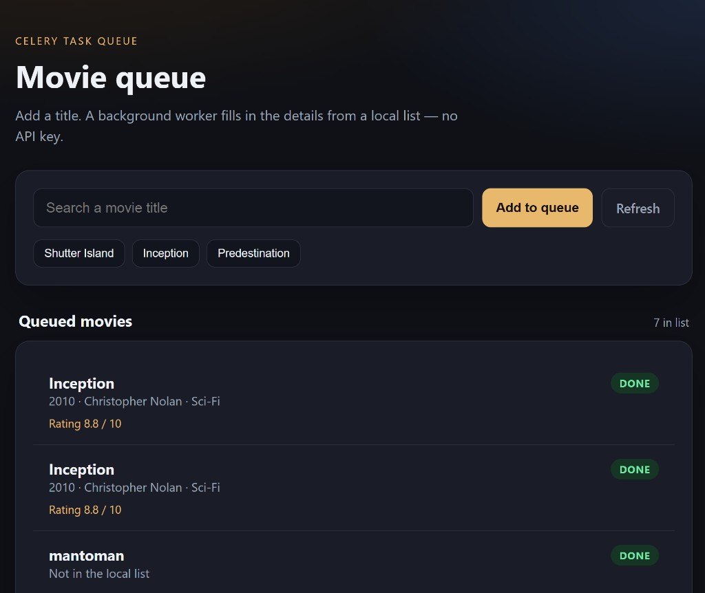

# Movie Queue

Django app with Celery. You add a movie title; a worker fills in the details from a local list. No API key.



## Run

```bash
cp .env.example .env
docker compose up --build
```

Open [http://127.0.0.1:8000/](http://127.0.0.1:8000/).

Type a title or click **Shutter Island**, **Inception**, or **Predestination**. Click **Refresh** after a couple of seconds to see `DONE`.

Other titles are saved as “Not in the local list”.

## How it works

1. Django saves a `Movie` row in **SQLite** with `status=pending`.
2. `lookup_movie.delay(id)` puts a job on **RabbitMQ**.
3. The Celery worker looks up the title in `movies/tasks.py` and updates the same row.
4. The page reads SQLite only.

**Redis** is Celery’s result backend (task finished/failed). It does not store movies.

| Service | Role |
|---------|------|
| `web` | Django on port 8000 |
| `celery_worker` | Runs `lookup_movie` |
| `rabbitmq` | Job queue (port 15672 for the management UI) |
| `redis` | Celery result backend |

## Project layout

```
config/          Django settings + Celery app
movies/          Model, views, task, templates
docker-compose.yml
```
